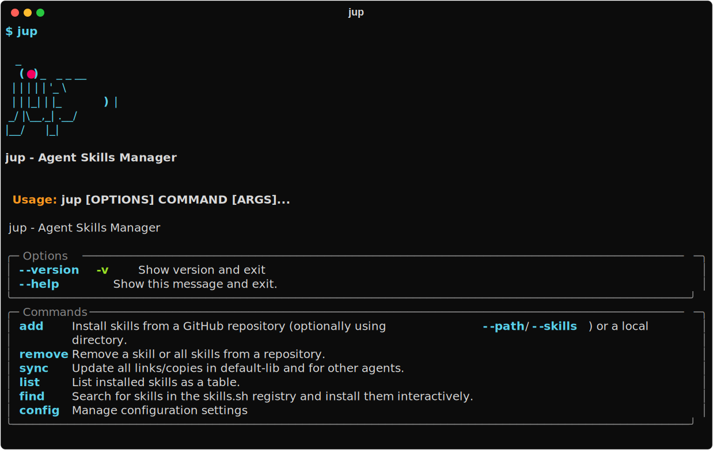
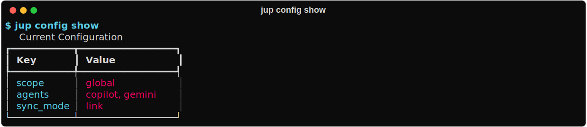
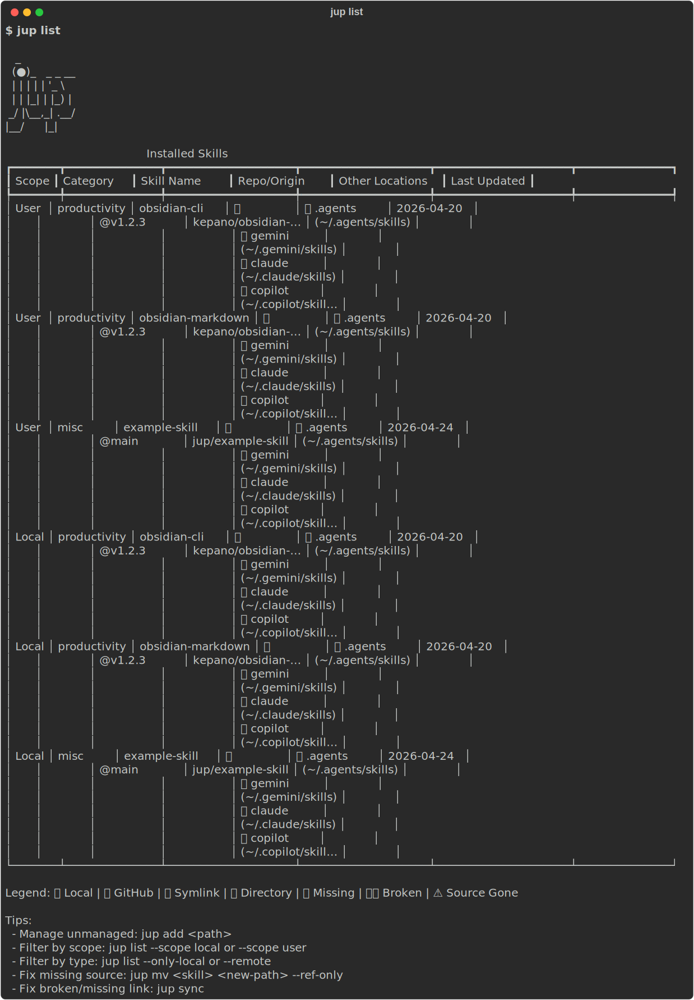

# jup ✨

`jup` is a small command-line tool for installing and syncing agent skills across the local skill directories used by supported AI assistants.

It helps you:

- install skills from GitHub repositories that expose a top-level `skills/` folder (or `.claude/skills/` as a fallback)
- keep installed skills organized in a lockfile so they can be synced again later
- copy or link skills into the directories used by agents like Gemini, Copilot, and Claude

## Features ✨

- **Multi-Agent Support**: Sync skills for Gemini, Copilot, and Claude.
- **Local-First**: Works with local skill directories and global configurations.
- **Git Integration**: Install and update skills directly from GitHub.

## Quick Start 🚀

### 1. Install `jup` 📦

The preferred way to install `jup` is from PyPI with `uv`:

```bash
uv tool install jup
jup --help
```



If you do not want to install it, you can run it on demand:

```bash
uvx jup --help
```

`pip` also works if you prefer a traditional install:

```bash
pip install jup
jup --help
```

### 2. Check the current configuration ⚙️

```bash
jup config show
```



### 3. Choose which agent directories should receive synced skills 🤖

```bash
jup config set agents gemini,copilot,claude
```

Use `none` to clear the list:

```bash
jup config set agents none
```

### 4. Add skills ➕

```bash
jup add owner/repo --category productivity
```

#### Search for skills 🔍

Search for skills in the `skills.sh` registry:

```bash
jup find instagram
```

By default, this lists matching skills. You can filter and limit the results:

```bash
jup find instagram --limit 5 --min-installs 100
```

To install a skill interactively from the search results, use the `--interactive` (or `-it`) flag:

```bash
jup find instagram --interactive
```

#### Advanced GitHub Usage

You can use `--path` to specify a subdirectory (default: `skills/`), and `--skills` to select specific skill names (comma-separated) to add from the skills directory:

```bash
jup add owner/repo --path custom/skills/dir --skills skill-a,skill-b --category productivity
```

- `--path` and `--skills` only work with GitHub sources (not local directories).
- If `--skills` is omitted, all skills in the specified path are added.
- If `--path` is omitted, the default is `skills/`.
- If the specified skills directory does not exist, `jup` will also look for `.claude/skills/` as a fallback.

You can also add local skills using relative or absolute paths (these ignore `--path` and `--skills`):

```bash
jup add ./local-skills --category productivity
jup add ../team-skills
jup add /absolute/path/to/local-skills
```

### 5. Review and update skills 📋

```bash
jup list
```



- Shows all installed skills, their source repo (with clickable links in supported terminals), install/update date, and which agent directories they are synced to.

#### Check for updates and apply them

```bash
jup sync --update
```

- Checks all installed GitHub skills for updates and applies them if available. Tracks the last update date for each source.
- You can also use `jup sync --check` to only check for updates without applying them.
- The update status and last checked date are shown in `jup list`.

### 6. Push the managed skills into the configured agent directories 🔄

```bash
jup sync
```

## Comparison with `npx skills` ⚖️

While Vercel's `npx skills` is a fantastic package manager for AI skills with a built-in search registry, `jup` focuses heavily on **centralized lockfile management** and **local symlink synchronization** across multiple agents. `jup` is ideal if you want to maintain a single source of truth for your skills and automatically symlink them to Gemini, Claude, and Copilot simultaneously, especially when authoring skills locally.

For a full breakdown of commands, pros, and cons, see the [jup vs. npx skills comparison](docs/jup-vs-npx-skills.md).

## What It Does 🧭

`jup` works with repositories that follow a simple structure:

```text
repo/
  skills/
    skill-name/
      SKILL.md
```

When you run `jup add owner/repo`, it clones the repository, finds every nested skill directory under `skills/` (or `.claude/skills/` if present) that contains a `SKILL.md` file, stores those skills in `~/.jup`, and records them in a lockfile.

For local sources, `jup add` supports either of these layouts:

```text
local-skills/
  skill-a/
    SKILL.md
  skill-b/
    SKILL.md
```

or a single skill directory:

```text
single-skill/
  SKILL.md
```

After that, `jup sync` installs the managed skills into the configured target locations. By default, `jup` uses symlinks, but you can switch to copying with:

```bash
jup config set sync-mode copy
```

### Update and Check Features

- `jup sync --update` checks for updates to all installed GitHub skills and updates them if new versions are available. The last update date is tracked per source.
- `jup sync --check` checks for updates but does not apply them.
- `jup list` shows the last update/check date and provides clickable links to the source repositories (in supported terminals).

The main configuration values are:

- `scope`: `global` or `local`
- `agents`: a comma-separated list of agent names
- `sync-mode`: `link` or `copy`

## Supported Agents 🧩

`jup` includes built-in locations for these agent names:

- `gemini`
- `copilot`
- `claude`
- `default`

## Contributing 🤝

Contributions are welcome. We use standard tools like `uv`, `ruff`, `ty`, `just`, and `pre-commit`. 

See [CONTRIBUTING.md](CONTRIBUTING.md) for detailed development setup, workflow, and publishing details.
