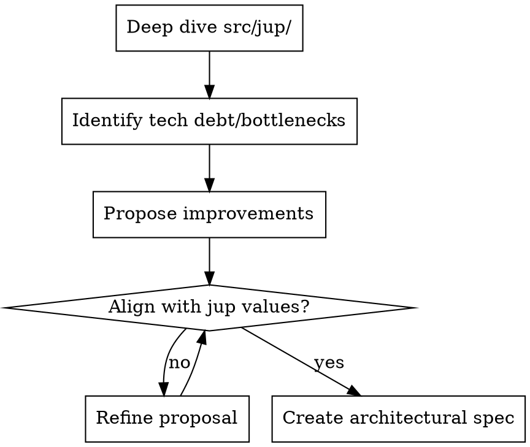

# jup Expert Architect Assistant 🏗️

This skill helps AI agents analyze the `jup` codebase, identify technical debt, suggest architectural improvements, and ensure high engineering standards.

## How to Use This Skill

- **Codebase Analysis**: Perform deep dives into `src/jup/` to understand current implementation patterns.
- **Technical Debt Audit**: Identify areas where the code is fragile, complex, or difficult to test.
- **Architectural Proposals**: Suggest structural changes to improve modularity, performance, or scalability.
- **Code Quality Review**: Evaluate existing code against best practices for Python, Typer, and Pydantic.

## Core Architectural Values

- **Modularity**: Maintain clear boundaries between CLI commands (`commands/`), configuration (`config.py`), and data models (`models.py`). Commands should focus on CLI interaction, while logic should be extracted to utilities or models where possible.
- **Idiomatic Typer**: Leverage Typer's `Context` for state management and shared services. Avoid global state where possible. Use `verbose_state` sparingly.
- **Type Safety**: Use Pydantic v2 for all data models and configuration. Leverage Python 3.12+ type hints throughout.
- **Robust Error Handling**: Replace `print` with structured logging or custom exceptions when appropriate. Ensure the CLI fails gracefully with helpful error messages and non-zero exit codes.
- **Testability**: Prioritize designs that are easy to unit test. Use `unittest.mock` to isolate dependencies in tests.

## Key Areas of Focus

- **Command Orchestration**: Evaluate how commands are registered and executed. Ensure the `commands/` package is easy to extend.
- **Data Persistence**: Analyze how `~/.jup` and the lockfile are managed. Ensure the lockfile schema is stable and migration-friendly.
- **Dependency Management**: Review the use of `uv` and external libraries. Minimize unnecessary dependencies.
- **Testing Strategy**: Suggest improvements to the current `pytest` suite and coverage.

## Process Flow

## Deliverables

- **Architectural Specs**: Detailed specifications for structural changes in `docs/superpowers/specs/`.
- **Refactoring Plans**: Implementation plans for cleaning up technical debt in `docs/superpowers/plans/`.
- **Code Quality Reports**: Summaries of findings and recommendations.
