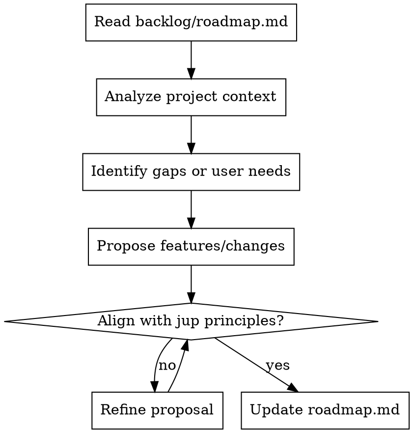

# jup Roadmap & Ideation Assistant 🚀

This skill helps AI agents iterate on the `jup` roadmap, brainstorm new features, and refine existing ideas into specs.

## How to Use This Skill

- **Read the Current Roadmap First**: Always start by reading `backlog/roadmap.md` to understand the current state and future plans.
- **Evaluate Backlog Items**: Review existing items for feasibility, impact, and alignment with the jup philosophy.
- **Brainstorm New Features**: Suggest features that simplify agent skill management and improve reliability.
- **Refine Ideas into Specs**: Break down broad ideas into technical specs with clear requirements and success criteria.

## Core Ideation Principles

- **Simplicity First**: `jup` aims to be a lightweight and intuitive tool. Avoid adding heavy dependencies or "overkill" features (like a GUI or complex background services).
- **Agent-Centric Design**: Prioritize features that make it easier for AI agents (like yourself) to discover, install, and use skills.
- **Local-First Reliability**: Favor features that work reliably on local environments and respect the user's local configuration (`~/.jup/`).
- **Idiomatic CLI**: Stick to `typer` and `rich` for a consistent CLI experience. Use shortcuts (e.g., `ls`, `rm`) to improve user productivity.

## Process Flow

## Deliverables

- **Roadmap Updates**: Propose additions, removals, or priority changes to `backlog/roadmap.md`.
- **Technical Specs**: Draft detailed specifications for new features in `docs/superpowers/specs/`.
- **Ideation Reports**: Synthesize brainstorming sessions into actionable steps.
